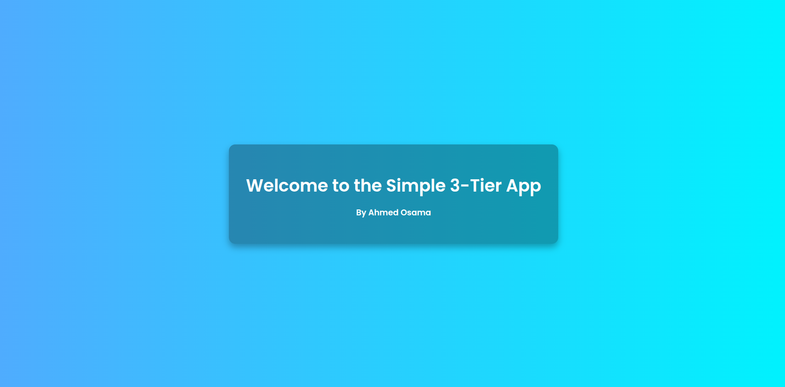

# 🌐 Bringing together Jenkins, AWS, and Ansible to create a robust CI/CD pipeline that’s secure, scalable, and fully automated 🤖!!

Here’s how I architected a secure and scalable pipeline using modern DevOps tools 🛠️

---

🔥 **Security Highlight**

🔐 **Ansible run locally** to provision:

- 🖥️ **Jenkins Master** on a **public EC2**
- 🛡️ **Jenkins Slave** + **Docker** on a **private EC2**, accessed securely via a **Jump Server**

🔁 The Jenkins agent registers itself automatically using the **Swarm plugin**, eliminating the need for manual node setup in the master. This supports dynamic, scalable, and secure agent registration — even when the controller can't directly reach the agent.

---

🔧 **What I Built**

✅ **Jenkins Controller** running on a public EC2 instance  
✅ **Jenkins Slave** inside a private subnet — connected securely using the **Swarm Client**  
✅ **Docker-based pipeline** that pulls code from GitHub, builds the image, and runs containers  
✅ **GitHub Webhook integration** — every push triggers the pipeline automatically  
✅ Final app deployed in a container and exposed securely to users

---

🧠 **Design Focus**

I designed this architecture with **security-first principles**, isolating critical components in a private network while enabling full CI/CD automation through secure, controlled access using a **jump server**.

---

💡 **Tools & Technologies Used**

- Jenkins
- Ansible
- Docker
- AWS EC2 
- GitHub Webhooks
- Terraform 

---

📸 **Demo in Action**

### ▶️ Before GitHub Push
_Awaiting webhook trigger..._

### ✅ After GitHub Push
_Pipeline automatically triggered, image built & deployed!_

---

🙌 If you're passionate about DevOps, cloud automation, or secure CI/CD pipelines — feel free to connect!

